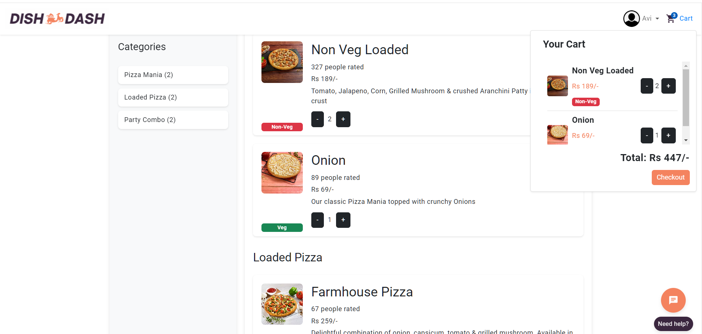

# DishDash

DishDash is a sophisticated web application designed to simplify the process of finding and ordering dairy products online, offering a range of features to enhance user convenience and engagement.

## Features

✅ **Complete Cart Management:** Streamlined cart management system for efficient order handling.

✅ **Automatic Location Detection:** Automatically detects user location for accurate restaurant options.

✅ **Dynamic Search Functionality:** Enables users to search for products by name or category with ease.

✅ **Notification Services:** Sends email notifications for order updates and other alerts.

✅ **User Authentication:** Secure login and account management.

✅ **Profile Management:** Allows users to update and manage their profiles.

✅ **Order History:** Provides detailed records of past orders.

✅ **AI-Powered Recommendations:** Enhances user experience with personalized product suggestions.

## Tech Stack

### Front-End:
Angular (Main Front-End Framework)

HTML

CSS

JavaScript

Bootstrap

### Back-End:
Spring Boot

REST APIs

### Databases:
MongoDB

MySQL

### Additional:
Version Control: GitHub

## Overview Video
[](https://www.youtube.com/watch?v=8FZFjvkYMn8&t=3s)

## Architecture Diagram


## Project Flow


## Screenshots





## Installation
To run this project locally, follow these steps:

1. **Clone the repository:**
   ```sh
   git clone https://github.com/avishmadaan/DishDash-Complete_Food_Ordering_Web_App
   
2. **Navigate to the project directory:**
    ```sh
   cd FrontEnd/DishDash

3. **Install dependencies**
    ```sh
    npm install

4. **Start the development server:**
    ```sh
   ng serve

5. **Start Backend servcies**

6. **Run your project on:**
```sh
   http://localhost:4200
